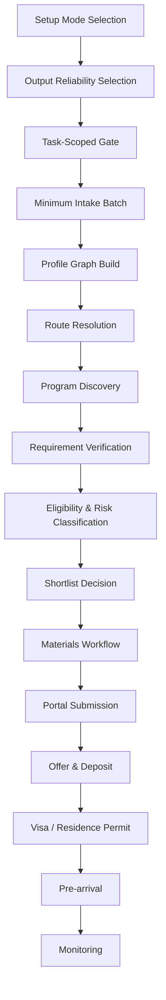
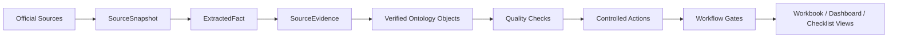

# University Application Skill

Open-source Codex Skill for managing international university applications as a source-backed admissions operating ontology.

## What This Skill Does

`study-abroad-advisor` is designed to replace a study-abroad agency workflow with a verifiable AI workflow. It helps a student move from early brainstorming to school selection, exact program selection, requirements tracking, essay planning, submission preparation, offer handling, and visa or residence-permit readiness.

The Skill does not treat admissions advice as a one-time answer. It treats each application as an evolving object graph with evidence, state, blockers, and controlled transitions.

The user-facing entry point is a guided setup layer. The Skill first asks for the current task, reliability level, and the minimum facts needed for that task. It supports quick triage, full shortlists, exact program selection, requirement audits, essay/SOP work, workbook rendering, submission readiness, source refresh, and visa-route research without forcing every request through full intake.

## Core Workflow



Each step is gated. If required information or official evidence is missing, the Skill creates blocking tasks and marks facts as `needs_official_check` instead of guessing.

## Guided Setup Layer

The setup layer keeps user interaction separate from admissions facts:

- `UserSetup`: selected workflow mode, output track, depth, source policy, privacy mode, and export target.
- `PreferenceWeight`: ranking, admission safety, budget, city, career, research fit, visa/work, and deadline-feasibility weights.
- `InteractionState`: completed setup cards, missing fields, blockers, warnings, and next questions.

Supported workflow modes:

| Mode | Purpose |
| --- | --- |
| `quick_triage` | Early brainstorming and missing-field discovery. |
| `full_shortlist` | School shortlist with reach/target/safer split. |
| `exact_program_selection` | Exact program comparison inside shortlisted schools. |
| `requirement_audit` | Official requirement matrix for known programs. |
| `essay_sop` | Evidence collection, academic-interest exploration, and statement planning. |
| `workbook_build` | Render structured case data into an `.xlsx` workbook. |
| `submission_readiness` | Pre-submit blocker and checklist review. |
| `source_refresh` | Refresh stale sources and identify impacted facts. |
| `visa_route` | Post-offer visa or residence-permit route research. |

Output tracks are explicit. `brainstorm` and `draft` outputs can guide thinking but must label unverified facts. `source_backed` and `verified` outputs require official evidence, lineage, freshness checks, and quality gates before final recommendations or submission decisions.

## Ontology-First Design

The workbook is not the source of truth. It is a view over ontology objects.



Minimum object set:

- `UserSetup`
- `PreferenceWeight`
- `InteractionState`
- `Applicant`
- `EducationCredential`
- `Institution`
- `Program`
- `ApplicationCase`
- `RequirementRule`
- `DocumentArtifact`
- `SourceEvidence`
- `Task`
- `RiskFlag`

Additional objects such as `Deadline`, `OfferDecision`, and `VisaImmigrationCase` are used when the case reaches deadlines, offers, deposits, post-offer documents, visa, residence permit, or pre-arrival planning.

Data-processing and governance objects are used when sources are researched or final outputs are rendered:

- `SourceSnapshot`
- `ExtractedFact`
- `FactVersion`
- `LineageEdge`
- `QualityCheck`
- `PipelineRun`
- `ActionEvent`
- `StudentEvidence`
- `ProgramFitFact`
- `EssayClaim`

## Data Lifecycle

The Skill follows a layered admissions data workflow:

| Layer | Objects | Purpose |
| --- | --- | --- |
| Bronze | `SourceSnapshot` | Preserve raw official source snapshots, retrieval time, URL, status, and hash. |
| Silver | `ExtractedFact` | Store candidate facts extracted from snapshots without treating them as verified. |
| Gold | `RequirementRule`, `Deadline`, `ProgramFitFact`, `RiskFlag`, `Task` | Use only source-backed facts for decisions, risk, checklists, and essay planning. |
| Platinum | Workbook views, shortlist, essay plan, submission checklist | Render user-facing outputs from verified ontology objects. |

Final recommendations must not come directly from raw web pages or extracted candidate facts. They must pass through quality checks and preserve lineage.

## Why Ontology Matters

International applications are not one linear checklist. A student's citizenship, residence country, education country, passport country, visa application country, document language, funding source country, and prior residence history can trigger different rules.

The Skill keeps these fields separate so it can reason about cases such as:

- a Chinese citizen studying in the UK applying to a UK master's program
- an Indian citizen living in the UAE applying to Canadian undergraduate programs
- a US citizen applying to a Netherlands exchange or master's route
- an EU/EEA citizen applying to Sweden
- a student applying through UCAS, Common App, uni-assist, Studielink, Universityadmissions.se, or a direct university portal

## Workflow Gates

The Skill uses gates to prevent premature outputs.

| Gate | Blocks Until |
| --- | --- |
| `ProfileCompletenessGate` | Degree level, intake, target countries, citizenship, residence, education country, passport country, GPA/scale, budget, language status, and document availability are known enough to research. |
| `RouteResolutionGate` | The application route is verified from an official institution, application-system, or government source. |
| `RequirementVerificationGate` | Each requirement has source evidence, checked date, source type, and verification status. |
| `SubmissionReadinessGate` | Program, campus, intake, deadline timezone, documents, recommender status, payment readiness, and source log are complete. |
| `OfferAndDepositGate` | Offer evidence, conditions, deposit timing, and post-offer document dependencies are recorded. |
| `VisaWorkflowGate` | Destination, citizenship, residence, passport, post-offer document route, and government-source evidence are verified. |

## Evidence Rules

Every material fact must link to `SourceEvidence`:

- deadlines
- tuition, deposits, application fees, and funding requirements
- language requirements and waivers
- GPA, class, credential, or grading equivalencies
- document requirements
- application routes
- visa or residence-permit rules
- work rights or post-study routes
- ranking claims
- program curriculum claims used for fit or essays

If official evidence is missing, the Skill marks the fact as `needs_official_check`.

## Quality And Lineage

The repository includes a dependency-free validator:

```bash
python study-abroad-advisor/scripts/validate_ontology.py study-abroad-advisor/tests/fixtures/ontology_mvp.json
```

Setup can be generated and checked before exposing the full ontology:

```bash
python study-abroad-advisor/scripts/onboard_admissions.py --mode full_shortlist --output-mode draft
python study-abroad-advisor/scripts/validate_setup.py study-abroad-advisor/tests/fixtures/user_setup_full_shortlist.json
python study-abroad-advisor/scripts/doctor_admissions_case.py study-abroad-advisor/tests/fixtures/ontology_mvp.json
```

Core checks include:

- no verified requirement without source evidence
- no deadline with due time but missing timezone
- no submitted case with open blockers
- no verified program-fit fact without source evidence
- no approved essay claim without student evidence and program-fit evidence
- stale source warnings
- valid setup mode and output mode
- task-gate required fields before gated output

Every final output should be traceable through `LineageEdge`, for example:

```text
SourceSnapshot -> ExtractedFact -> RequirementRule -> ApplicationCase -> WorkbookCell
StudentEvidence + ProgramFitFact -> EssayClaim -> SOPParagraph
```

## Main Skill Resources

- [`SKILL.md`](study-abroad-advisor/SKILL.md): entrypoint and operating rules.
- [`references/intake.md`](study-abroad-advisor/references/intake.md): adaptive intake and brainstorming workflow.
- [`references/research.md`](study-abroad-advisor/references/research.md): source hierarchy and research rules.
- [`references/ontology.md`](study-abroad-advisor/references/ontology.md): ontology operating model.
- [`references/setup/setup-workflow.md`](study-abroad-advisor/references/setup/setup-workflow.md): setup modes, output tracks, and task-scoped gates.
- [`references/setup/onboarding-flow.yaml`](study-abroad-advisor/references/setup/onboarding-flow.yaml): setup cards and workflow routing.
- [`references/setup/task-gates.yaml`](study-abroad-advisor/references/setup/task-gates.yaml): required fields by task.
- [`references/setup/user-setup.schema.json`](study-abroad-advisor/references/setup/user-setup.schema.json): user setup JSON schema.
- [`references/setup/prompt-templates.md`](study-abroad-advisor/references/setup/prompt-templates.md): guided prompt templates.
- [`references/data-lifecycle.md`](study-abroad-advisor/references/data-lifecycle.md): Bronze/Silver/Gold/Platinum pipeline.
- [`references/quality-checks.md`](study-abroad-advisor/references/quality-checks.md): quality gates and failure policy.
- [`references/lineage.md`](study-abroad-advisor/references/lineage.md): source-to-output traceability.
- [`references/governance.md`](study-abroad-advisor/references/governance.md): privacy and public/private data separation.
- [`references/refresh-policy.md`](study-abroad-advisor/references/refresh-policy.md): source staleness and fact-diff policy.
- [`references/release-process.md`](study-abroad-advisor/references/release-process.md): controlled release process for rule bundles.
- [`references/ontology/object_types.yaml`](study-abroad-advisor/references/ontology/object_types.yaml): object schemas.
- [`references/ontology/action_types.yaml`](study-abroad-advisor/references/ontology/action_types.yaml): controlled actions.
- [`references/ontology/workflow_gates.yaml`](study-abroad-advisor/references/ontology/workflow_gates.yaml): state transition gates.
- [`references/ontology/rule_bundles.yaml`](study-abroad-advisor/references/ontology/rule_bundles.yaml): country-route rule bundle templates.
- [`references/ontology/quality_checks.yaml`](study-abroad-advisor/references/ontology/quality_checks.yaml): machine-readable validation checks.
- [`references/ontology/lineage_rules.yaml`](study-abroad-advisor/references/ontology/lineage_rules.yaml): required lineage paths.
- [`references/ontology/access_policies.yaml`](study-abroad-advisor/references/ontology/access_policies.yaml): data access and redaction policy.
- [`references/ontology/view_definitions.yaml`](study-abroad-advisor/references/ontology/view_definitions.yaml): declarative view dependencies and freshness rules.
- [`references/workbook-schema.md`](study-abroad-advisor/references/workbook-schema.md): JSON contract for workbook views.
- [`scripts/build_admissions_workbook.py`](study-abroad-advisor/scripts/build_admissions_workbook.py): dependency-free XLSX builder.
- [`scripts/validate_ontology.py`](study-abroad-advisor/scripts/validate_ontology.py): dependency-free ontology validator.
- [`scripts/validate_setup.py`](study-abroad-advisor/scripts/validate_setup.py): dependency-free setup and task-gate validator.
- [`scripts/doctor_admissions_case.py`](study-abroad-advisor/scripts/doctor_admissions_case.py): blocker, warning, allowed-output, and next-question diagnostic.
- [`scripts/onboard_admissions.py`](study-abroad-advisor/scripts/onboard_admissions.py): setup packet generator for guided onboarding.

## Workbook Builder

The builder accepts ontology-first JSON and legacy array-based JSON.

```bash
python study-abroad-advisor/scripts/build_admissions_workbook.py input.json output.xlsx
```

When ontology data is present, the builder validates quality gates before rendering. `--skip-validation` exists only for draft output and must not be used for verified recommendations.

When ontology data is present, the workbook renders object-state views such as:

- applicant objects
- education credentials
- institutions
- programs
- application cases
- requirement rules
- document artifacts
- tasks
- risk flags
- deadlines
- offer decisions
- visa cases
- source evidence
- source snapshots
- extracted facts
- fact versions
- lineage edges
- quality checks
- pipeline runs
- action events
- user setup
- preference weights
- interaction state
- student evidence
- program fit facts
- essay claims

Legacy views such as school shortlist, program comparison, requirements matrix, essay plan, submission checklist, source log, and regional program sheets remain supported.

## Example Workflow Output

Instead of only saying:

```text
You can apply to A, B, and C. Materials include transcript, CV, SOP, and references.
```

The Skill should produce object state:

```text
ApplicationCase.case_001
status: requirements_verified
route: university_portal
blocking_tasks:
- task_004: verify_ATAS_requirement
- task_007: request_official_transcript
verified_requirements:
- req_001: transcript
- req_002: SOP
unverified_requirements:
- req_009: language waiver
risk_flags:
- risk_002: deadline timezone not confirmed
- risk_004: visa document dependency unresolved
```

This makes the workflow auditable and prevents unsupported admissions claims.

## License

MIT License. See [`LICENSE`](LICENSE).
